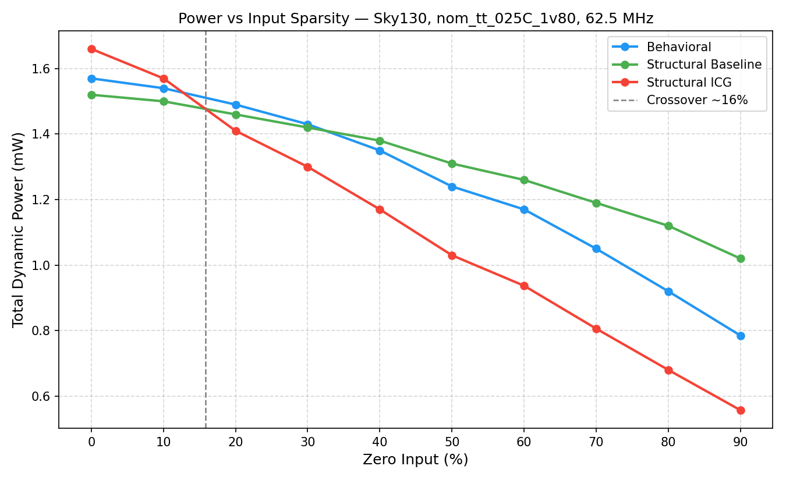

# Booth-Wallace Multiplier: Three-Design Power Comparison on Sky130


-red>)


Three 16-bit signed multiplier designs (behavioral, structural, and structural with clock gating) built and compared on Sky130. Power is measured using actual switching activity from gate level simulation across a full sparsity sweep, not static estimates. The target workload is sparse, zero heavy inputs like you'd see in neural network inference.

## Table of Contents

- [1. Overview](#1-overview)
- [2. Three Design Variants](#2-three-design-variants)
- [3. Testing Methodology](#3-testing-methodology)
  - [3.1 Functional Verification](#31-functional-verification)
  - [3.2 Static Power Estimation](#32-static-power-estimation)
  - [3.3 Dynamic Power Measurement](#33-dynamic-power-measurement)
- [4. Results](#4-results)
  - [4.1 Functional Verification](#41-functional-verification)
  - [4.2 Physical Design Summary](#42-physical-design-summary)
  - [4.3 Static Power](#43-static-power)
  - [4.4 Dynamic Power](#44-dynamic-power)
  - [4.5 Clock Skew Trade-off](#45-clock-skew-trade-off)
- [5. How to Reproduce](#5-how-to-reproduce)

## 1. Overview

In neural network inference, a lot of multiplications involve at least one zero (pruned weights, ReLU outputs, sparse activations). A standard multiplier just keeps chugging along anyway, burning power on a result it already knows is zero.

The question is how much power can you actually save by catching those zeros early and shutting off the clock? To answer that, three designs were built and compared:

| Design                  | Description                                                             |
| ----------------------- | ----------------------------------------------------------------------- |
| **Behavioral**          | `A * B` inferred by synthesizer, baseline reference                     |
| **Structural Baseline** | Radix-4 Booth encoding, Wallace tree, Brent-Kung, no power optimization |
| **Structural ICG**      | Same as baseline plus zero-operand detection and sky130 ICG cell        |

**Key findings:**

- ICG starts beating structural baseline at just **~16% zero input**, meaning even moderately sparse workloads benefit.
- At 90% zero (heavily pruned networks), ICG saves **45.4%** vs structural baseline.
- Static power estimates overestimate by **2.1x to 3.4x** compared to real VCD based measurements.
- All three designs close timing with zero DRC/LVS violations.

## 2. Three Design Variants

### 2.1 Behavioral (`behavioral/`)

The simplest implementation, just one RTL file. `Top.v` uses Verilog's `*` operator and lets the synthesizer figure out the microarchitecture.

```verilog
// Stage 1
always @(posedge clk) A_ff <= A; B_ff <= B;

// Stage 2
always @(posedge clk) Output <= A_ff * B_ff;
```

No structural knowledge and no power optimization. The synthesizer (Yosys) decides everything automatically.

### 2.2 Structural Baseline (`structural-baseline/`)

The multiplier is fully custom designed with 6 RTL files. Same clock, same interface, but the datapath is explicit using Booth encoder, partial product generator, CSA Wallace tree, Brent-Kung adder.

There is **no zero detection**. Even when both inputs are zero, the DFF clocks in the values, the Booth encoders compute, the Wallace tree reduces, and the adder sums. All switching, even for a result that's obviously zero.

### 2.3 Structural ICG (`structural-icg/`)

Same with 6 files structural design, with two additions in `Top.v` and `DFF.v`:

**Layer 1: Clock Gating**

```verilog
wire clock_enable = !((A == 16'b0) || (B == 16'b0));
```

When either input is zero, `clock_enable` goes low. The ICG cell (`sky130_fd_sc_hd__dlclkp_1`) stops `clk_gated` from toggling, so the DFF never captures the inputs and the entire downstream datapath including Booth encoders, Wallace tree, Brent-Kung adder never switches.

**Layer 2: Output Mux**

The ICG blocks the DFF, so `A_ff`/`B_ff` hold their old values. A separate always on delay register (`A_del`, `B_del`) tracks the previous cycle's inputs:

```verilog
wire zero_out = (A_del == 16'b0) || (B_del == 16'b0);
always @(posedge clk)
    Output <= zero_out ? 32'b0 : OUT;
```

This ensures the output is correctly forced to zero even though the multiplier didn't run.

#### `ifdef SYNTHESIS` Guard

The ICG cell is a physical Sky130 standard cell that is not recognized by RTL simulators such as iverilog. To maintain compatibility across different stages, `DFF.v` uses a compile time guard:

- **Synthesis (LibreLane / Yosys)**  
  With `VERILOG_DEFINES: [SYNTHESIS]`, the design instantiates `sky130_fd_sc_hd__dlclkp_1` to implement real clock gating at the hardware level

- **RTL Simulation (iverilog)**  
  Without the `SYNTHESIS` define, the design falls back to a behavioral equivalent using a clock enable condition (`else if (clock_enable)`), so it can be functionally simulated without requiring the physical standard cell

## 3. Testing Methodology

All three designs share the same clock (16 ns / 62.5 MHz), the same I/O interface (16-bit signed A and B, 32-bit signed Output), the same PDK (Sky130 HD), the same LibreLane flow, and the same timing and power constraints. The only variable is the RTL. This ensures the comparison is controlled and fair.

### 3.1 Functional Verification

**File:** `<design>/tb/tb_Top.v`

Before measuring power, each design is verified to produce correct results. 17 test cases cover signed edge cases, zero operands, identity, negation, powers of two, and alternating bit patterns.

The testbench is self checking. It drives inputs, waits exactly 2 clock cycles which is the pipeline latency, then compares `Output` against the expected product computed in Verilog. Results are in [Section 4.1](#41-functional-verification).

### 3.2 Static Power Estimation

LibreLane's built-in power report (generated at the end of the RTL-to-GDS flow) assumes a fixed toggle rate for every signal, typically 0.1 to 0.2 transitions per clock. It has no knowledge of what inputs the design will actually see, and no awareness of clock gating.

This is useful as a baseline comparison against real measured power. Results are in [Section 4.3](#43-static-power).

### 3.3 Dynamic Power Measurement

Unlike static estimation, dynamic power measurement uses real switching activity captured from simulation. The flow is divided into four steps.

---

### 1. Power Testbench

File `<design>/tb/tb_Top_power.v`

The power testbench drives 1000 random input vectors per run and records switching activity using a VCD file.

**Input generation**  
Controlled by a compile time parameter `ZERO_PCT` passed with `iverilog -DZERO_PCT=<value>`. Each cycle, the testbench evaluates `($urandom % 100) < ZERO_PCT`.

If the condition is true, one of three cases is chosen with equal probability. A is zero only, B is zero only, or both are zero.  
If the condition is false, both A and B are forced to be non zero. Any `$urandom` result equal to zero is changed to one.

This ensures a clean statistical probability that at least one operand is zero for ZERO_PCT percent of cycles.

**VCD dump**  
`$dumpvars(0, tb_Top_power.uut)` records every signal transition inside the design under test. This VCD file is later used by OpenROAD for power analysis.

**Self checking**  
The testbench compares every output against the expected product with a one cycle pipeline delay. This guarantees correctness even during power measurement runs.

---

### 2. Gate Level Simulation

RTL simulation is not sufficient for power analysis because it does not model real cell behavior, wire capacitance, or the clock tree. Gate level simulation uses the synthesized netlist so switching activity matches the physical design.

**Flow**

1. LibreLane generates the gate level netlist `final/nl/Top.nl.v`
2. `iverilog` compiles the netlist together with Sky130 standard cell models `primitives.v` and `sky130_fd_sc_hd.v`, along with the power testbench
3. `vvp` runs the simulation and produces `sim_out/gate_level.vcd`

The VCD captures all signal transitions over the 1000 cycle simulation window inside `tb_Top_power/uut`.

---

### 3. OpenROAD Power Analysis

Power analysis runs inside OpenROAD using `read_power_activities` to load the VCD, then `report_power` to compute results.

**Inputs**

| Input             | File                                | Description           |
| ----------------- | ----------------------------------- | --------------------- |
| Physical database | `final/odb/Top.odb`                 | Placement and routing |
| Parasitics        | `final/spef/nom/Top.nom.spef`       | Capacitance per net   |
| Activity          | `sim_out/gate_level.vcd`            | Toggle rate per net   |
| Liberty           | `sky130_fd_sc_hd__tt_025C_1v80.lib` | Cell power models     |

**How it works**  
For each net, OpenROAD reads the toggle count from the VCD and divides it by the total simulation time to get the activity rate.

The dynamic power is computed as `power = activity_rate × capacitance × V² × f`

Corner used is `nom_tt_025C_1v80` with a clock period of 16 ns (62.5 MHz).

The final report breaks power into internal, switching, and leakage components, and also groups them into sequential, combinational, and clock contributions.

---

### 4. Sparsity Sweep

A single operating point is not enough to understand behavior. The goal is to see when ICG starts helping and how the benefit scales with sparsity.

**Range and context**

| Range  | Workload                                                   |
| ------ | ---------------------------------------------------------- |
| 0%     | Dense network without pruning, worst case for ICG          |
| 30-50% | Typical ReLU sparsity in CNNs                              |
| 50-70% | ReLU with light pruning, common in inference               |
| 70-90% | Aggressive pruning such as MobileNet or EfficientNet style |

A full 100 percent zero case is not included because it is unrealistic in real workloads.

**Sampling**  
Ten uniformly spaced points are used from 0 to 90 percent.

**Automation**  
`run_sweep.sh` runs all combinations across sparsity and design variants.  
`parse_sweep.py` collects results from all runs and generates `sweep_results.csv` and `docs/power_vs_sparsity.png`.

## 4. Results

### 4.1 Functional Verification

| Case      | Description                                          |
| --------- | ---------------------------------------------------- |
| TC1-TC4   | Small signed values: positive, negative, mixed signs |
| TC5       | Max positive × max positive (32767 × 32767)          |
| TC6       | Min signed × 1 (−32768 × 1)                          |
| TC7       | Min signed × min signed (−32768)²                    |
| TC8       | Mid-range mixed (1000 × −2000)                       |
| TC9-TC11  | Zero operands: A=0, B=0, both=0                      |
| TC12-TC13 | Identity: × 1 and 1 ×                                |
| TC14-TC15 | Negation: × (−1) and (−1) ×                          |
| TC16      | Power-of-2 (256 × 128)                               |
| TC17      | Alternating bits (0x5555 × 0xAAAA)                   |

The test cases are designed to cover a wide range of scenarios including edge cases, sign handling, arithmetic identities, and bit patterns to ensure correctness across all operating conditions.

| Design              | Passed | Failed |
| ------------------- | ------ | ------ |
| Behavioral          | 17/17  | 0      |
| Structural Baseline | 17/17  | 0      |
| Structural ICG      | 17/17  | 0      |

### 4.2 Physical Design Summary

All three designs went through the full LibreLane RTL-to-GDS flow on Sky130 HD, with timing closed at 16 ns (62.5 MHz) across all PVT corners.

| Metric                | Behavioral | Structural Baseline | Structural ICG |
| --------------------- | ---------- | ------------------- | -------------- |
| Instance count        | 2,154      | 1,770               | 1,876          |
| Core area (µm²)       | 14,187     | 12,251              | 13,269         |
| Setup WNS tt (ns)     | 0          | 0                   | 0              |
| Hold WNS tt (ns)      | 0          | 0                   | 0              |
| Setup WNS ss (ns)     | 0          | 0                   | 0              |
| Setup violations      | 0          | 0                   | 0              |
| Hold violations       | 0          | 0                   | 0              |
| DRC errors (Magic)    | 0          | 0                   | 0              |
| DRC errors (KLayout)  | 0          | 0                   | 0              |
| LVS errors            | 0          | 0                   | 0              |
| IR drop worst (mV)    | 0.16       | 0.09                | 0.15           |
| Total wirelength (µm) | 34,732     | 34,047              | 34,173         |

Behavioral has the most instances because Yosys infers a generic multiplier with more intermediate cells than the fully custom design. ICG is slightly larger than the baseline because of the added ICG cell, delay registers (`A_del`, `B_del`), and output mux (+8.3% area).

### 4.3 Static Power

LibreLane's built-in power estimate assumes a fixed toggle rate for every signal (typically 0.1 to 0.2 transitions per clock). It has no knowledge of what inputs the design will actually see, and no awareness of clock gating.

| Design              | Static Power (LibreLane) |
| ------------------- | ------------------------ |
| Behavioral          | 2.87 mW                  |
| Structural Baseline | 2.48 mW                  |
| Structural ICG      | 2.77 mW                  |

Based on these numbers alone, all three designs look roughly similar. ICG appears to offer no benefit. This gives an incomplete picture, and [Section 4.4](#44-dynamic-power) shows why.

### 4.4 Dynamic Power

Power measured with OpenROAD using gate level VCD activity. See [Section 3.3](#33-dynamic-power-measurement) for the full methodology.



**Comparison with static estimates**  
Across the sweep, static estimation tends to overestimate the actual power by around 2.1x to 3.4x depending on the design. This happens because it assumes a constant switching activity and does not reflect real signal behavior. The gap is most noticeable in the ICG design, where the clock can be gated and large parts of the circuit stop switching entirely. Since static analysis cannot capture this effect, it reports higher power than what actually occurs. This is why activity based power analysis is important for obtaining realistic results.

**Where the savings come from**  
ICG gives the biggest reduction in switching power because the clock tree stops toggling completely when the inputs are zero. Internal power also goes down since fewer transitions happen inside the cells. Leakage stays the same because all cells are still powered.

**Crossover point around 16% zero input**  
Below this point, ICG actually uses a bit more power than the structural baseline. This happens because the delay registers and output mux still toggle but there is no benefit from clock gating yet. Once you go above this point, ICG starts to win and the gap keeps increasing as inputs become more sparse.

**Structural baseline vs behavioral**  
The structural baseline consistently uses more power than the behavioral design. This might feel a bit unexpected. The manually built Wallace tree creates a more complex combinational path compared to what Yosys generates from the `*` operator, so it ends up switching more. More detailed structure does not always mean lower power. The real improvement comes from clock gating in the ICG design.

**Relative improvement at high sparsity**  
At low sparsity such as 0% to 10%, ICG provides little benefit and can even consume slightly more power than the structural baseline. However, at high sparsity such as 80% to 90%, ICG reduces power by around 40% to 45% compared to the baseline. This shows that clock gating becomes significantly more effective as zero inputs become more frequent.

### 4.5 Clock Skew Trade-off

Adding ICG means there are two clock networks in the same design. One uses `clk` directly to drive some flip flops, while the other uses `clk_gated` through the ICG cell. Because these paths have different lengths, the clock does not arrive at the same time at every register.

|                       | Behavioral | Structural Baseline | Structural ICG |
| --------------------- | ---------- | ------------------- | -------------- |
| Worst setup skew (ns) | 0.138      | 0.133               | 0.648          |
| Worst hold skew (ns)  | −0.205     | −0.200              | +0.298         |
| Timing violations     | 0          | 0                   | 0              |

ICG skew is ~5x higher, but at 0.648 ns out of a 16 ns clock period that's only 4%. The CTS tool handles it fine, and there are zero timing violations across all corners.

The negative hold skew on the other two designs is intentional. It means the capturing FF gets its clock slightly before the launching FF, giving more hold margin. CTS tools sometimes introduce this on purpose.

## 5. How to Reproduce

### Prerequisites

| Tool               | Purpose                       |
| ------------------ | ----------------------------- |
| `iverilog` + `vvp` | RTL and gate level simulation |
| `librelane`        | RTL-to-GDS synthesis and P&R  |
| `openroad`         | VCD-based power analysis      |
| Sky130 HD PDK      | Standard cell library         |

The scripts auto detect sky130 from `$SKY`, `$PDK_ROOT`, `~/.ciel`, or `~/pdk`. OpenROAD is picked up from PATH or `/nix/store`. If auto-detection fails, you'll get a clear error message telling you what to set.

### Step 1: RTL Simulation (no LibreLane needed)

```bash
./run_rtl_sim.sh
```

Runs functional testbench (17 test cases) and power testbench for all three designs. Results saved to each design's `sim_out/`.

### Step 2: RTL-to-GDS (run once per design)

```bash
librelane behavioral/config.yaml
librelane structural-baseline/config.yaml
librelane structural-icg/config.yaml
```

Each run generates the netlist, ODB, and SPEF files needed for the next steps.

### Step 3: Sparsity Sweep

```bash
./run_sweep.sh
```

Runs gate level simulation and power analysis across 10 sparsity levels (0% to 90%) for all three designs. Takes roughly 15-30 minutes. Outputs `sim_out/power_report_N.log` and `sim_out/gate_level_N.vcd` per design, where N is the sparsity percentage (0, 10, 20, ..., 90).

Then generate the graph and CSV:

```bash
nix-shell -p python3Packages.matplotlib python3Packages.pandas \
    --run "python3 parse_sweep.py"
```

Outputs `sweep_results.csv` and `docs/power_vs_sparsity.png`.
